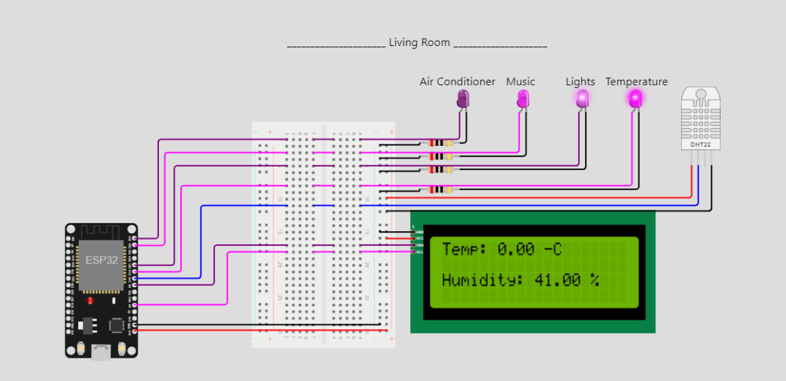

# ESP32 Weather & Device Controller

Welcome to the ESP32 Weather & Device Controller project! This project combines the power of ESP32 micro-controller, weather data sensing, device control, and MQTT communication to create a smart environment control system. Whether you're new to ESP32 or an experienced developer, this project provides a hands-on learning experience and a foundation for building IoT applications.

## Table of Contents

- [ESP32 Weather \& Device Controller](#esp32-weather--device-controller)
  - [Table of Contents](#table-of-contents)
  - [Introduction](#introduction)
  - [Features](#features)
  - [Components](#components)
  - [Getting Started](#getting-started)
    - [Prerequisites](#prerequisites)
    - [Setting Up the Simulation](#setting-up-the-simulation)
    - [Running the Project](#running-the-project)
  - [Code Structure](#code-structure)
  - [Contributing](#contributing)
  - [License](#license)
  - [Acknowledgments](#acknowledgments)
  - [Contact](#contact)

## Introduction

The ESP32 Weather & Device Controller project integrates weather data collection and control of devices like LEDs using an ESP32 micro-controller. It communicates with an MQTT broker, allowing remote control and monitoring. This project showcases the capabilities of ESP32 for IoT applications and introduces you to Python programming for embedded systems.

## Features

- Real-time temperature and humidity measurement using the DHT22 sensor.
- Remote control of LEDs representing different devices.
- Display of temperature and humidity data on an LCD screen.
- Communication with an MQTT broker for remote interaction.
- Modular code structure with abstraction layers for hardware, MQTT, and project logic.

## Components

- ESP32 DevKit V1
- LEDs (purple, magenta, red)
- Resistors
- DHT22 Sensor
- LCD2004 Display
- Breadboard for connections
> Please note that the LEDs included in the simulation are placeholders to represent real components, as physical LEDs might not be available in the virtual environment.

## Getting Started

### Prerequisites

- Basic knowledge of programming and electronics.
- An ESP32 DevKit V1 board.
- Access to the Wokwi simulation platform (optional for testing).

### Setting Up the Simulation

1. Visit the [Wokwi simulation platform](https://wokwi.com/) and create an account if needed.
2. Create a new simulation project and paste the provided JSON configuration.
3. Run the simulation to visualize the components and interactions.

### Running the Project

1. Clone or download this repository to your local machine.
2. Open the code files in your preferred Python IDE or text editor.
3. Modify the code to match your hardware setup, Wi-Fi credentials, and MQTT settings.
4. Upload the code to your ESP32 DevKit V1 board.
5. Power on your board and observe the device control and data display.

## Code Structure

The code is structured into abstraction layers, enhancing modularity and readability. Three main classes are used: `HardwareRoom` for hardware configuration, `MQTTBrokerRoom` for MQTT communication, and `ProjectRoom` for project coordination.

## Contributing

Contributions to this project are welcome! Feel free to submit pull requests for bug fixes, new features, or improvements.

## License

This project is licensed under the [MIT License](LICENSE).

## Acknowledgments

- [Wokwi](https://wokwi.com/) for the simulation platform.
- The open-source community for providing libraries and tools used in this project.

## Contact

For questions or inquiries, contact [nassim.bennsib@gmail.com](mailto:nassim.bennsib@gmail.com).
